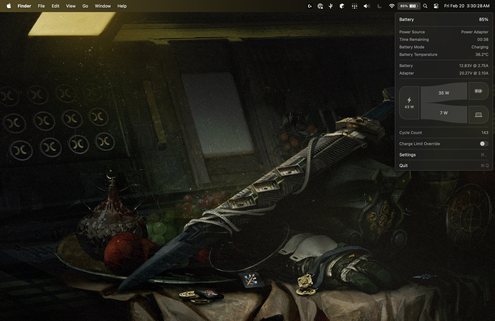
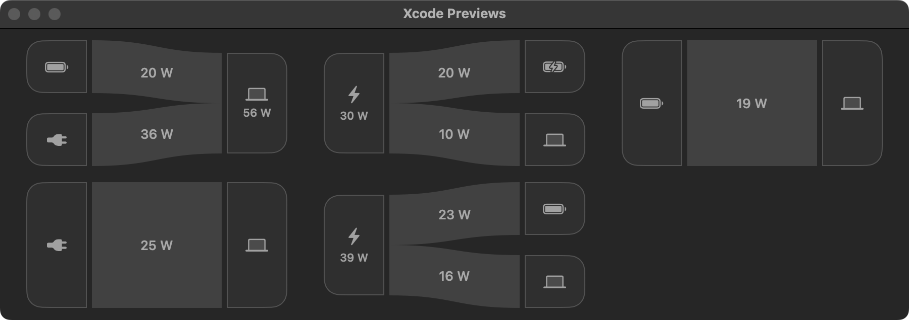
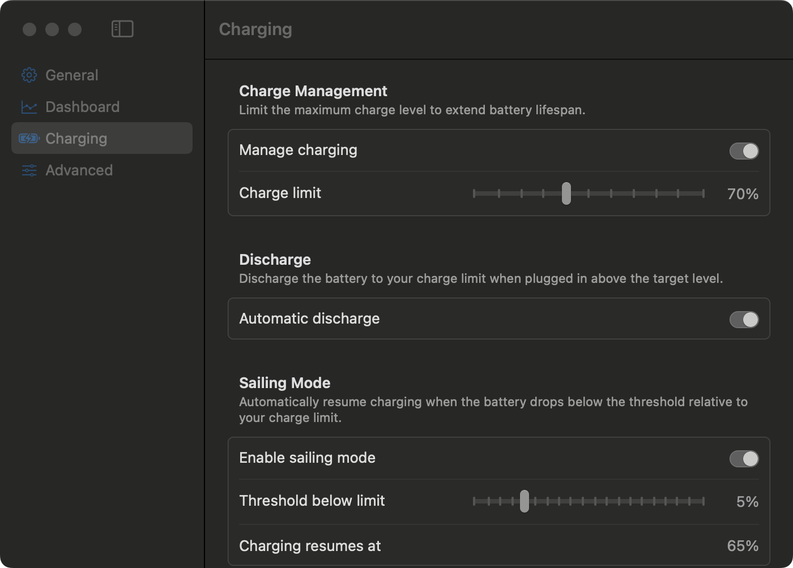

# Stasis

**A smarter battery icon for your MacBook.** Monitor power metrics, manage charge limits, and extend your battery's lifespan — all from the menu bar.

Stasis gives you real-time insight into your MacBook's power system and lets you control charging behavior directly, without relying on macOS's opaque "Optimized Battery Charging."

> **Apple Silicon only.** Tested on M1 and M4. Other Apple Silicon chips should work but are untested.
>
> Requires **macOS 14.8 – 26.3**.

<!-- Screenshot: menu bar dropdown showing battery info, power metrics, and Sankey diagram -->


## Installation

Because Stasis is an unsigned application, macOS requires you to explicitly authorize it before it can be opened.

### Homebrew (Recommended)

Install the app using the `--no-quarantine` flag to automatically bypass the Gatekeeper security warning:

```bash
brew install --cask --no-quarantine srimanachanta/tap/stasis
```

### Direct Download
1. Download from [GitHub Releases](https://github.com/srimanachanta/Stasis/releases).
2. Open the .dmg and drag Stasis into your /Applications folder.
3. Open Terminal and run this command to remove the Apple quarantine restriction:
```bash
xattr -cr /Applications/Stasis.app
```
4. Open Stasis normally from your Applications folder.

## Features

<details>
<summary><strong>Real-Time Power Dashboard</strong></summary>

The menu bar dropdown shows live power data pulled directly from the system firmware:

- Battery percentage (macOS-calibrated or raw hardware value)
- Power source and time remaining
- Battery and adapter voltage, current, and wattage
- System power draw
- Battery temperature, health, and cycle count
- System uptime

Every metric is individually toggleable in settings.

</details>

<details>
<summary><strong>Power Flow Visualization</strong></summary>

A Sankey diagram in the menu shows how power flows through your system in real time — from adapter and battery to system load. See at a glance whether your MacBook is charging, discharging, or running on pass-through power.



</details>

<details>
<summary><strong>Charge Limit Management</strong></summary>

Set a maximum charge level (50–100%) to reduce long-term battery wear. When the limit is reached, Stasis inhibits charging at the hardware level. This persists through sleep aswell.

- **Automatic Discharge** — Optionally force the system to run on battery power when above the limit, even while plugged in.
- **Sailing Mode** — Instead of toggling charging on and off around the limit, Stasis holds the battery at your target by floating on adapter power. A configurable threshold (1–20% below the limit) controls when charging resumes.
- **Charge Limit Override** — Temporarily charge to 100% without disabling charging management. One click in the menu.

<!-- Screenshot: Settings window, Charging tab -->


</details>

<details>
<summary><strong>Heat Protection</strong></summary>

When battery temperature exceeds a configurable threshold (30–50 C), Stasis automatically pauses charging regardless of the current charge level. Charging resumes once the battery cools down.

</details>

<details>
<summary><strong>MagSafe LED Control</strong></summary>

On supported MacBooks, Stasis overrides the MagSafe LED to reflect charging state:

- **Green** — at or above the charge limit
- **Orange** — actively charging
- **Configurable during heat protection** — off, green, orange, or blinking orange

</details>

<details>
<summary><strong>Localization</strong></summary>

Stasis is available in:

- English
- German
- Spanish
- Japanese

Translations are community-contributed. Some strings may be incomplete in non-English languages.

</details>

## How It Works

Stasis uses a three-process architecture:

| Component | Privilege | Role |
|---|---|---|
| **Stasis** | User | UI, business logic, menu bar |
| **helper** | User | Reads (voltage, current, power) |
| **charging-helper*** | Root | Writes (charge inhibit, discharge, MagSafe LED) |

Stasis functions by directly communicating with the System Management Controller (SMC) to monitor and control power metrics. Because this controller is powered even when the system is in deep sleep, power management settings still work.

SMC reads happen through an unprivileged XPC service embedded in the app bundle. Power metrics are polled at 1-second intervals only while the menu is open.

The privileged helper is a LaunchDaemon registered through `SMAppService` and is only installed when you enable "Manage Charging" in settings. The daemon only runs while charging management is active and resets all SMC keys to defaults when it stops.

For most sensor values and state management, Stasis hooks into the native IOKit framework — the same one Apple uses for the native battery icon — to detect state changes such as plugging in the laptop or when battery percentage changes. This means all logic is reactive to system events, so the app has near-zero resource usage when the menu is closed.

## Building from Source

**Requirements:**
- macOS 15.7+
- Xcode with Swift 6+ support

```bash
git clone https://github.com/srimanachanta/Stasis.git
cd Stasis
open stasis.xcodeproj
```

Build and run the `stasis` scheme in Xcode. The project uses Swift Package Manager for dependencies, which Xcode resolves automatically.

## Contributing

PRs welcome. Please open an issue first for large changes.

## Acknowledgments

- [SMCKit](https://github.com/srimanachanta/SMCKit) — SMC access library
- [AsahiLinux](https://asahilinux.org/) — SMC key reverse engineering
- [Battery-Toolkit](https://github.com/mhaeuser/Battery-Toolkit) — SMC key documentation

## License

[GPL-3.0](LICENSE)
